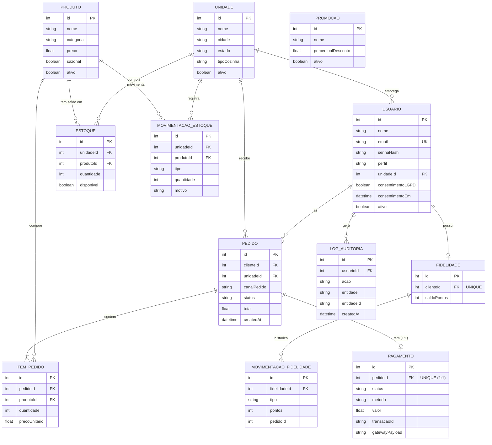

# DER — Diagrama Entidade-Relacionamento

Modelo de dados da API Raízes do Nordeste (banco SQLite via Prisma).

> **Como gerar a imagem para o PDF:** copie o bloco `mermaid` abaixo, cole em
> [https://mermaid.live](https://mermaid.live) e exporte como PNG/SVG.

## Relacionamentos e cardinalidades

| Relação | Cardinalidade | Regra |
|---------|---------------|-------|
| Usuário → Pedido | 1:N | um cliente faz vários pedidos |
| Unidade → Estoque | 1:N | cada unidade tem estoque próprio |
| Produto ↔ Unidade (via Estoque) | N:N | saldo por unidade; `@@unique(unidadeId, produtoId)` |
| Pedido → ItemPedido | 1:N | um pedido contém vários itens |
| Pedido → Pagamento | 1:1 | pagamento desacoplado (`pedidoId` UNIQUE) |
| Usuário → Fidelidade | 1:1 | carteira só com consentimento LGPD |
| Fidelidade → MovimentacaoFidelidade | 1:N | histórico de pontos |

## Observação técnica (ENUM no SQLite)

O SQLite (via Prisma) **não suporta o tipo ENUM nativo**. Por isso, campos como
`canalPedido`, `status`, `perfil` e `tipo` são modelados como **String** e
validados na camada de aplicação (constantes de domínio em `src/domain/enums.js`
+ validação Zod). Em um banco como PostgreSQL, esses campos seriam ENUMs nativos.
