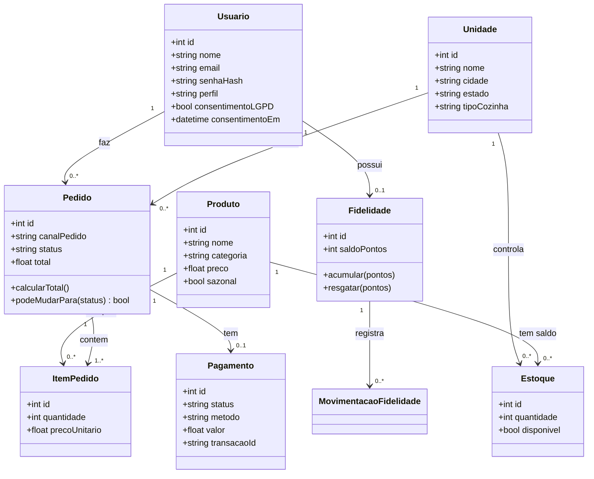

# Diagrama de Classes (visão de domínio)

> **Como gerar a imagem:** copie o bloco `mermaid` abaixo, cole em
> [https://mermaid.live](https://mermaid.live) e exporte como PNG.

```mermaid
classDiagram
    class Usuario {
        +int id
        +string nome
        +string email
        +string senhaHash
        +string perfil
        +bool consentimentoLGPD
        +datetime consentimentoEm
    }
    class Unidade {
        +int id
        +string nome
        +string cidade
        +string estado
        +string tipoCozinha
    }
    class Produto {
        +int id
        +string nome
        +string categoria
        +float preco
        +bool sazonal
    }
    class Estoque {
        +int id
        +int quantidade
        +bool disponivel
    }
    class Pedido {
        +int id
        +string canalPedido
        +string status
        +float total
        +calcularTotal()
        +podeMudarPara(status) bool
    }
    class ItemPedido {
        +int id
        +int quantidade
        +float precoUnitario
    }
    class Pagamento {
        +int id
        +string status
        +string metodo
        +float valor
        +string transacaoId
    }
    class Fidelidade {
        +int id
        +int saldoPontos
        +acumular(pontos)
        +resgatar(pontos)
    }

    Usuario "1" --> "0..*" Pedido : faz
    Usuario "1" --> "0..1" Fidelidade : possui
    Unidade "1" --> "0..*" Estoque : controla
    Unidade "1" --> "0..*" Pedido : recebe
    Produto "1" --> "0..*" Estoque : tem saldo
    Produto "1" --> "0..*" ItemPedido : compoe
    Pedido "1" --> "1..*" ItemPedido : contem
    Pedido "1" --> "0..1" Pagamento : tem
    Fidelidade "1" --> "0..*" MovimentacaoFidelidade : registra
```
